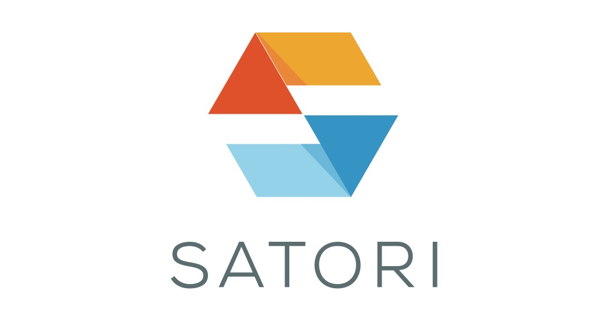

# Satori Motion Demo



Satori provides an API that sends data between apps at high speed. The API uses a publish/subscribe model: Apps *publish* data of 
any type to a *channel*, and other apps *subscribe* to that channel and retrieve data from it. The API, based on WebSocket, 
transfers any amount of data with almost no delay.

Satori APIs also let you customize channels:
* Satori **streambots** subscribe to a channel and execute custom code on each incoming message. You create a streambot using a Satori Java API.
* Satori **views** select, transform, or aggregate messages from a channel based on criteria you define in fSQL, a Satori-defined subset of SQL:2003.

The motion demo app shows you how the Satori API works:

1. A JavaScript app, running in the browser of a mobile device, publishes the orientation of the device to a Satori channel. 
1. A JavaScript app running in a computer browser subscribes to the channel and reads the orientation data from it.
1. The app running on the computer changes the position of an image in the browser window to match the orientation of the mobile device.

# Run the online demo
A live version of the demo is available at [https://motion.satori.com](https://motion.satori.com). To see the demo, open the 
link in a browser running on a computer and follow the instructions on the screen.

**Hint:** The instructions tell you to share a URL with users who have a mobile device. Try sharing it with *lots* of mobile
users. You still see all of their changes occur immediately. 

# Run the demo locally
You can get the source files for the demo and run it locally. The source includes JavaScript for the mobile device
and the computer, the Satori API library, and a server for hosting the page on the computer.  

## Prerequisites
To run the demo locally, you need:
* A computer that supports Node.js
* A mobile device that has an orientation sensor. iPhone and Android phones and tablets have these sensors.
* Node.js version 6.0.0 or later

All of the demo code is included in the GitHub clone or installed using `npm` after you have the code.

## Get credentials from Satori
Set up a Satori account and create a project for credentials.

1. Log in or sign up for a Satori account at [https://developer.satori.com](https://developer.satori.com).
1. From the dashboard, navigate to the **Projects** page.
1. Click **Add a project**, then enter the name "Motion" and click **Add**.
1. Satori displays an `appkey` and `endpoint` for your project. These credentials let the JavaScript apps connect with Satori. 
Make a copy of them.
1. Save the project.

## Get the demo code
The demo code is available in a public GitHub repository. It's based on React, using the [Create React App](https://github.com/facebookincubator/create-react-app) framework. As a result, you have access to all the tools provided by `react-scripts`.

1. Clone the demo source files from GitHub:

```
git clone git@github.com:satori-com/motion.git
cd orientation-demo
```

1. In `orientation-demo`, edit `.env`, then add the `appkey` and `endpoint` values:

```
REACT_APP_ENDPOINT='<endpoint_value>'
REACT_APP_APPKEY='<appkey_value>'
```

1. Build the local server for the computer. `npm install` downloads and installs the frameworks and APIs used by the demo, based on the specifications in `package.json`:

```
npm install
```
1. Run the local server and start the demo web page:

```npm run start```

1. The server displays the demo page. Follow the instructions on the screen, but instead of clicking **Share** , switch focus to the terminal app in which you started the server. 
A message lists the IP address of the server on your local network.
1. To complete the demo, enter the server IP address in the URL bar of a browser running on a mobile device. Move the device around, the image on the web page in the computer browser moves.

# App architecture

The device orientation demo apps use the following frameworks and APIs:
* [React](https://github.com/facebook/react) JavaScript framework
* [Satori JavaScript SDK](https://github.com/satori-com/satori-rtm-sdk-js)
* [Device orientation web API](https://developer.mozilla.org/en-US/docs/Web/API/Detecting_device_orientation)

The demo has 3 major components: App, AppMobile, and AppDesktop.

- [App](src/App.js) is the parent of both AppMobile and AppDesktop. It subscribes to a Satori channel and maintains a list of 
  mobile devices and their orientations.
- [AppMobile](src/components/AppMobile.js) listens for device orientation events and publishes them to the Satori channel.
- [AppDesktop](src/components/AppDesktop.js) displays all the devices in the current room. It uses 
[Phone component](src/components/Phone.js) to rotate images in the desktop browser in
response to mobile device orientation changes.

The Satori APIs are in [lib/rtm.js](src/lib/rtm.js). They subscribe to a Satori channel using a [view](https://www.satori.com/docs/using-satori/filters), which lets the desktop app choose data that is specific to the current room.

The [Satori Paint Demo](https://github.com/satori-com/paint) and [Satori Chat Demo](https://github.com/satori-com/chat) show you other ways to interact with users. 

# Next steps

The device orientation demo shows you how to use the Satori platform to exchange data between apps.

To learn more about the app, try the following ideas:

* Make the device orientation interaction into a game. 
* Build an augmented reality app. Send live data using the Satori platform by sending live data across RTM, modify the data using 
[Satori streambots](https://www.satori.com/docs/bots/getting-started), and display the augmented video to users.

# Further reading
* [Satori Developer Documentation](https://www.satori.com/docs/introduction/new-to-satori): Documentation for the entire Satori Live Data Ecosystem 
* [Satori JavaScript SDK](https://github.com/satori-com/satori-rtm-sdk-js): The Satori JavaScript API and developer tools
* [Satori JavaScript tutorial](https://www.satori.com/docs/rtm-sdks/tutorials/javascript-tutorial)):  Tutorial that shows you how to write JavaScript apps that use the SDK and the [Satori Live Messaging](https://www.satori.com/docs/using-satori/rtm-api) platform 
